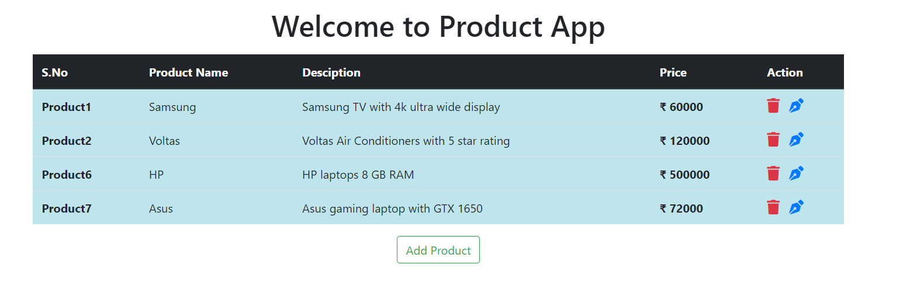
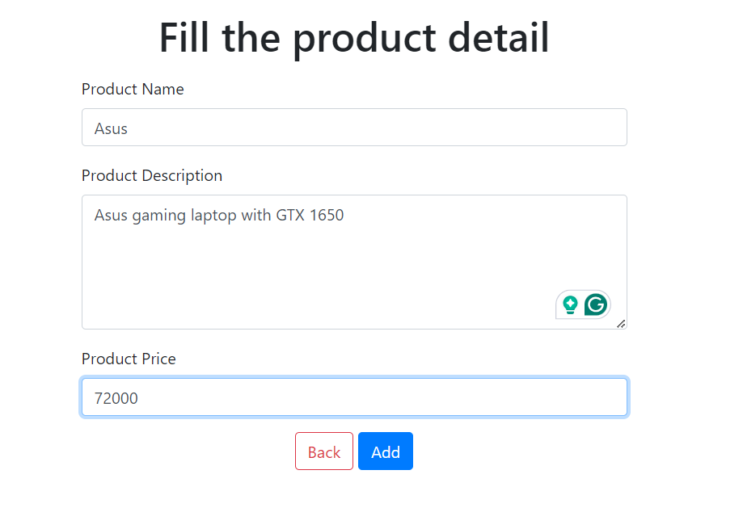
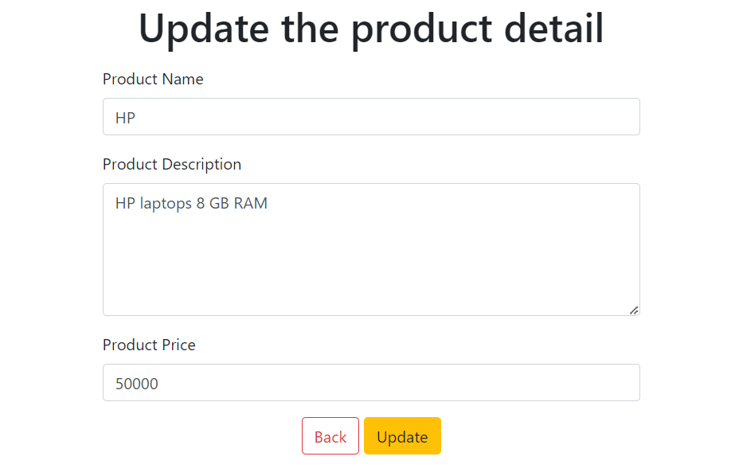

# Product Registry

A product management system built using Spring Core with a Model-View-Controller (MVC) pattern. It supports operations to add, update, view, and delete products, using Hibernate for database interactions and MySQL for data storage.

## Features

- View a list of products
- Add new products
- Edit existing products
- Delete products

### Screenshots

1. **Display All Products**  
   

2. **Add Poducts**  
   

3. **Update Products**  
   

## Technologies Used

- **Spring Core (MVC)**: Framework used for developing the application logic and handling web requests.
- **JSP**: Used for rendering server-side views.
- **Hibernate**: Object-relational mapping tool for interacting with the database.
- **MySQL**: Relational database for product storage.
- **Maven**: Dependency management and project building.

## Project Structure

- **Controller**: Manages HTTP requests and application logic (product management).
- **DAO (Data Access Object)**: Manages database interactions using Hibernate.
- **Model**: Represents the `Product` entity.
- **View**: Server-side rendered views with JSP pages.

## Setup Instructions

### Prerequisites

- Java 8 or higher
- Maven
- MySQL database
- IDE like IntelliJ, Eclipse, or VS Code

### Steps to Run the Application

1. **Clone the repository**:
   ```bash
   git clone <repository-url>
   cd product-registry

### Configure the Database
1. Create a MySQL database named `product_registry`.
2. Modify the database configurations in `spring-servlet.xml`:

    ```xml
    <bean class="org.springframework.jdbc.datasource.DriverManagerDataSource" name="ds">
        <property name="driverClassName" value="com.mysql.cj.jdbc.Driver"/>
        <property name="url" value="jdbc:mysql://localhost:3306/product_registry"/>
        <property name="username" value="your_username"/>
        <property name="password" value="your_password"/>
    </bean>
    ```

### Build the Project Using Maven
 ```bash
 mvn clean install
 ```

### Deploy the WAR File on a Servlet Container (e.g., Tomcat)

1. Locate the generated WAR file in the target directory (`productapp.war`).
2. Deploy it to Tomcat or any other servlet container.

### Access the Application

Once deployed, visit `http://localhost:8080/productapp/` in your browser.

### Endpoints
- `/` - Displays a list of products.
- `/addProduct` - Form to add a new product.
- `/handle-form` - Handles product creation.
- `/delete/{productId}` - Deletes a product by its ID.
- `/update/{productId}` - Updates a product's information.

### Contributing
Feel free to fork this project and submit pull requests for improvements or features.
